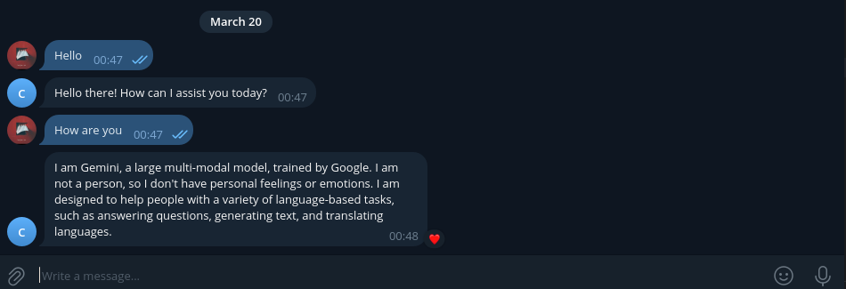

<!--Please do not remove this part-->

# Script Title

Gemini AI Telegram BOT
**Bring the power of Google AI to your Telegram chats!**

<!--An image is an illustration for your project, the tip here is using your sense of humour as much as you can :D 

You can copy paste my markdown photo insert as following:

-->

## 🛠️ Description
<!--Remove the below lines and add yours -->
This Python script seamlessly integrates the Gemini Generative AI model into a Telegram bot, allowing you to engage in stimulating conversations right within your favorite messaging app. Ask questions, explore creative text formats, and tap into a wide range of knowledge with ease.

## ⚙️ Languages or Frameworks Used
<!--Remove the below lines and add yours -->
Python 3.6 or later \
Telegram Bot API \
google-generativeai 

**To install required modules:**

`pip install -r requirements.txt`

## 🌟 How to run
<!--Remove the below lines and add yours -->
Create a Telegram bot using BotFather and obtain its API token.

Set up a Google Cloud project and enable the Google Generative AI API.

Create a .env file in the project directory with the following variables:

`TELEGRAM_BOT_TOKEN=your_bot_token`\
`GOOGLE_API_KEY=your_google_api_key`

Run the script:

`python main.py`\
Interact with the bot in Telegram by sending it text messages.

## 📺 Demo

## 🤖 Author
<!--Remove the below lines and add yours -->
https://github.com/yousseftarhri

